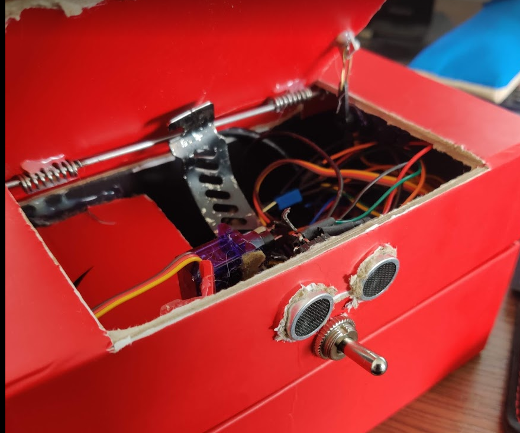
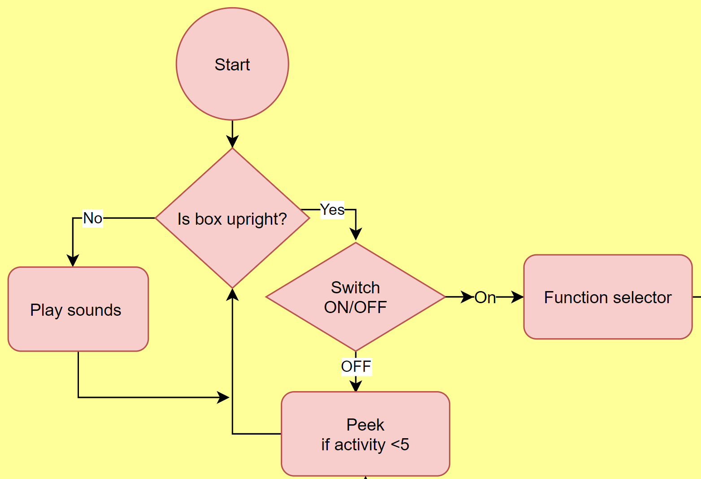

# UselessBox

UselessBox school project made with arduino

Useless box is just a box with one switch and when switch is turned the device turns the switch off. 


To add mode functions this useless box has range-finder, speaker and accelerometer.

### Project contents
```
Arduino Uno
HC-SR04
GY-61
Two servos
Speaker
Usb power bank
```




*Demo Gif* 



*State Diagram*


## Functions

1. Closes switch
2. Slowly move arm to close switch
3. Jerks back and fort the arm before closing the switch
4. Peak, Close Switch, Peak, 
5. Waits users hand to be at least 25 cm away before closing the switch.
6. Moves arm according to how close users hand is. Lasts 20 seconds. 

7. Play music. Plays Star Wars Imperial march from speaker and moves arm in beat of the song.

8. Random function. Randomises arm movements and time to taken close the switch. 

9. Peak. Peaks if unused for five times before going sleep

10. Tilt sound. If device is not flat, it makes sound depending on the angle. Self-calibrates when arduino is first powered on. 


### Problems

* HC-SR04 can´t accurately get users hand positions. Works better against flat surfaces. 


